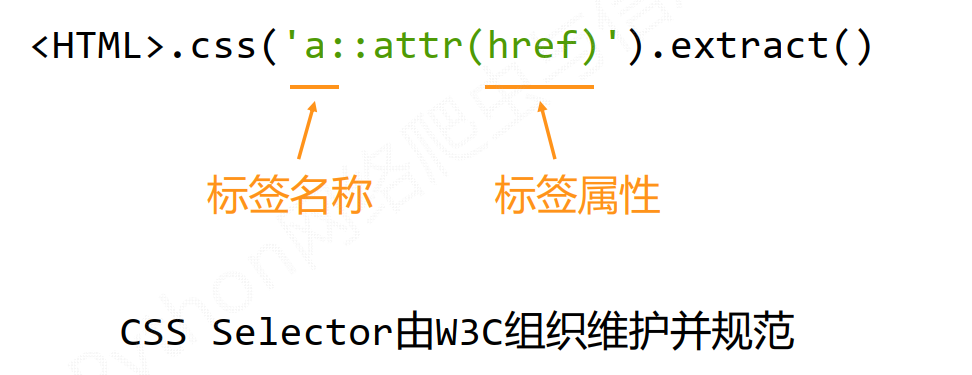

## Scrapy

### Install

```shell
pip install -r requirements.txt
```

### Usage

```shell
scrapy -h

scrapy startproject <project_name>

cd <project_name>

scrapy genspider <spider_name> www.reddit.com/r/gameofthrones/

scrapy runspider <spider_file_path>

scrapy crawl zipru -o torrents.jl
```

### Configuration

* scrapy.cfg: 部署scrapy爬虫的配置文件,把爬虫部署到特定的服务器上，并且在服务器配置好相关的操作接口
* settings.py: scrapy爬虫的配置文件
* allowed_domains: 只能爬取这个链接以下的域名链接
* start_urls: scrapy爬取的初始页面url
* parse: 对返回的页面处理响应，解析网页内容形成字典，从网页中发现新url爬取请求

#### Scrapy爬虫的使用步骤

* 建立工程和Spider模板
* 编写Spider
* 编写Pipeline
* 配置优化

### yield keyword

* 生成器是一个不断产生值的函数,
* 包含yield语句的函数是一个生成器
* 生成器每次产生一个值(yield语句)，函数被冻结，被唤醒后再产生一个值
* yield from将在一个协程中调用另一个协程，并且得到另一个协程的返回结果

#### generator

一个函数执行到某一个位置产生一个值，然后它被冻结，再次被唤醒的时候还是
从这个位置继续去执行，那么每次执行的时候就可能产生一个数据，这样这个函数
不停的执行就产生了源源不断的数据，这样的函数就叫generator.

generator一般和循环语句一起使用,generator相比一次列出所有内容的advantages

* 更节省存储空间
* 响应更加迅速
* 使用更加灵活

### Scrapy shell usage

```shell
scrapy shell

>>fetch("https://www.reddit.com/r/gameofthrones/")

view(response)

print(response.text)

response.css('.className::text').extract()

response.css('.className::text').extract_first()

response.css('className').extract_first()

response.css(".classname1.classname2").extract_first()

```

response.css() is a function that helps extract content based on 
css selector passed to it.The ‘.’ is used with the className because it’s a css class selector,Also you need to use ::text to tell your scraper to extract only text content of the matching elements

When more than two selectors are required to identify an element, we use them both. Also since both are CSS classes we have to use “.” with their names.

* response - An object that the scrapy crawler returns,This object
contains all the information about the downloaded content.
* response.css(..) - Matches the element with the given css selector.
* extract_first(...)-Extract the 'first' element that matches the given criteria
* extract(..)-Extract 'all' element that matches the given criteria.

#### Scrapy vs requests

* 没有处理js、提交表单、应对验证码等功能（可扩展）

> requests

* 页面级爬虫
* 功能库
* 并发性考虑不足，性能较差
* 重点在于页面下载
* 定制灵活
* 上手十分简单
* 非常小的需求， requests库


> scrapy

* 网站级爬虫
* 框架
* 并发性好，性能较高
* 重点在于爬虫结构
* 一般定制灵活，深度定制困难
* 入门稍难
* 不太小的需求， Scrapy框架
* Scrapy采用命令行创建和运行爬虫,命令行（不是图形界面）更容易自动化，适合脚本控制,本质上， Scrapy是给程序员用的，功能（而不是界面）更重要

#### Scrapy data type

###### Request class

* class scrapy.http.Request()
* Request对象表示一个HTTP请求
* 由Spider生成，由Downloader执行

|属性或方法 |说明|
|----------|----|
|.url |Request对应的请求URL地址|
|.method |对应的请求方法， 'GET' 'POST'等|
|.headers |字典类型风格的请求头|
|.body |请求内容主体，字符串类型|
|.meta |用户添加的扩展信息，在Scrapy内部模块间传递信息使用|
|.copy() |复制该请求|

###### Response class

* class scrapy.http.Response()
* Response对象表示一个HTTP响应
* 由Downloader生成，由Spider处理

|属性或方法 |说明|
|----------|----|
|.url |Response对应的URL地址|
|.status |HTTP状态码，默认是200|
|.headers |Response对应的头部信息|
|.body |Response对应的内容信息，字符串类型|
|.flags |一组标记|
|.request |产生Response类型对应的Request对象|
|.copy() |复制该响应|

###### Item class

* class scrapy.item.Item()
* Item对象表示一个从HTML页面中提取的信息内容
* 由Spider生成，由Item Pipeline处理
* Item类似字典类型，可以按照字典类型操作

#### Scrapy爬虫提取信息的方法

Scrapy爬虫支持多种HTML信息提取方法：
• Beautiful Soup
• lxml
• re
• XPath Selector
• CSS Selector(国际公认的html页面的提取方法)

#### CSS Selector的基本使用



#### 如何进一步提高scrapy爬虫爬取速度?

	优化scrapy爬虫爬取的速度依赖与scrapy配置文件选项settings.py
一共有4个参数，这些参数都与并发连接有关系.通过改变请求数量改变爬取速率

|选项 |说明|
|-----|---|
|CONCURRENT_REQUESTS |Downloader最大并发请求下载数量，默认32|
|CONCURRENT_ITEMS |Item Pipeline最大并发ITEM处理数量，默认100|
|CONCURRENT_REQUESTS_PER_DOMAIN |每个目标域名最大的并发请求数量，默认8|
|CONCURRENT_REQUESTS_PER_IP |每个目标IP最大的并发请求数量，默认0，非0有效|

#### Scrapy爬虫的地位

* Python语言最好的爬虫框架
* 具备企业级专业爬虫的扩展性（ 7x24高可靠性）
* 千万级URL爬取管理与部署
* 简单说： Scrapy足以支撑一般商业服务所需的爬虫能力

#### Scrapy应用的展望

> 持续爬取、商业服务、高可靠性

###### 普通价值

* 基于Linux， 7x24，稳定爬取输出
* 商业级部署和应用 (scrapyd‐\*)
* 千万规模内URL爬取、内容分析和存储

###### 高阶价值

* 基于docker，虚拟化部署
* 中间件扩展，增加调度和监控
* 各种反爬取对抗技术

#### Overview of XPath and XML

XPath is a syntax that is used to defines XML documents.
It can be used to traverse through am xml document, Note that
XPaht's follows a hierarchy.

If you press ctrl-f in the DOM inspector then you’ll find that you can use this css expression as a search query (this works for xpath too!).